<div align="center">


[](https://git.io/typing-svg)

<br/>

[](https://github.com/manojalwisnz?tab=followers)
[](https://github.com/manojalwisnz)
[](https://githubmate.ai)

</div>

---

## `> whoami`

```
  Mobile / AI Engineer ─ New Zealand 🇳🇿
  ─────────────────────────────────────────────────────────────
  Currently  →  GitHubMate.ai
                Free, browser-only security scanner for AI-generated code.
                Detects OWASP Top 10, LLM Top 10, secrets, CVEs, IaC issues
                in ~30 seconds. No signup. No backend. Just results.

  Focus      →  📱 Mobile apps (React Native · Swift · Kotlin)
                🤖 AI / LLM engineering (OpenRouter · LangChain · Claude)
                🔐 Security tooling (SAST · secrets detection · compliance)
                🌐 Web (React 19 · TypeScript · Tailwind · D3.js)
```

---

## `> featured --project`

<table>
<tr>
<td valign="top" width="55%">

### [🔐 GitHubMate.ai](https://githubmate.ai)

> **Free AI-code security scanner.** Scan any public GitHub repo for vulnerabilities in ~30 seconds — no signup, no data collection, runs entirely in your browser.

**What it catches:**
- 🔑 Secrets & API key exposure — 30+ named token patterns + entropy scanning
- 🛡️ OWASP Top 10 + OWASP LLM Top 10 — 123+ SAST patterns
- 📦 Dependency CVEs — real-time via OSV.dev (npm · PyPI · Go · Ruby · Maven)
- 🗺️ **Attack Surface Map** — interactive Security Knowledge Graph (unique)
- 📋 Compliance signals — SOC 2 · GDPR · HIPAA · PCI DSS

[](https://githubmate.ai)
[](https://github.com/manojalwisnz/GitHubMate)

</td>
<td valign="top" width="45%" align="center">



</td>
</tr>
</table>

---

## `> tech --stack`

**Mobile**


**Web & Backend**


**AI / LLM**


**Tooling & Infra**


---

## `> stats --github`

<div align="center">


&nbsp;&nbsp;


<br/><br/>


</div>

---

## `> activity --graph`

<div align="center">


</div>

---

<div align="center">

**`> connect --open`**

<br/>

[](https://linkedin.com/in/manojalwis)
[](https://x.com/manojalwis)
[](https://githubmate.ai)
[](mailto:happynewzealanders@gmail.com)

<br/>


</div>
